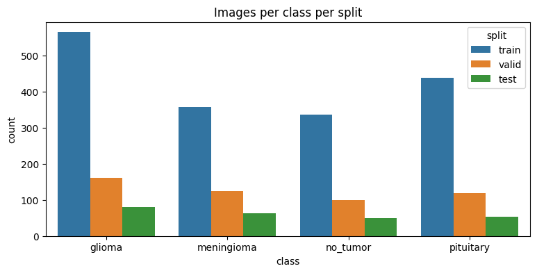
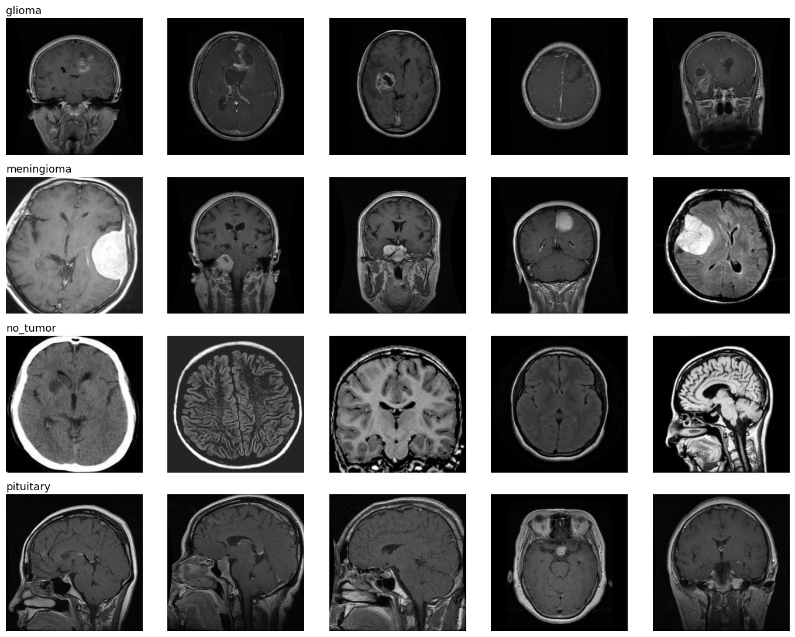
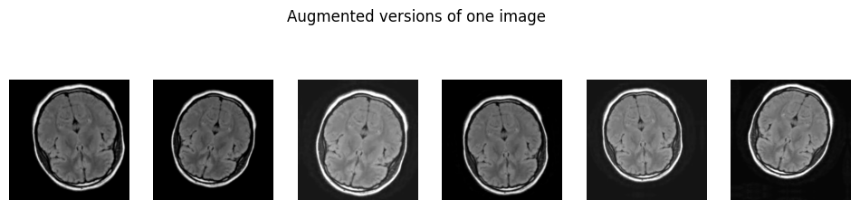
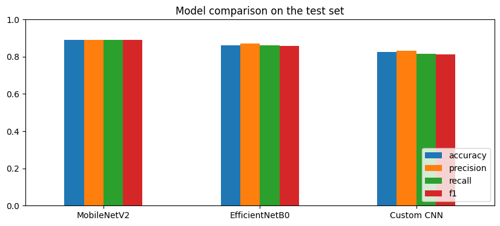
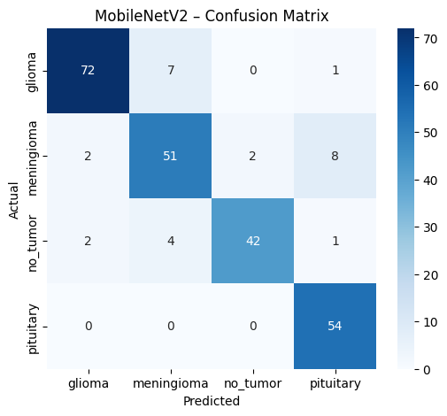
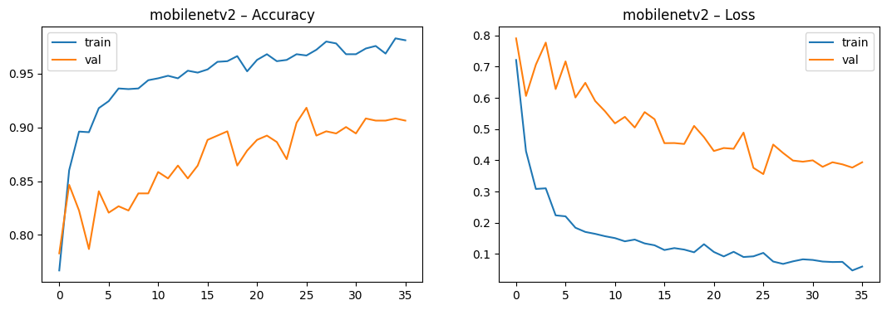
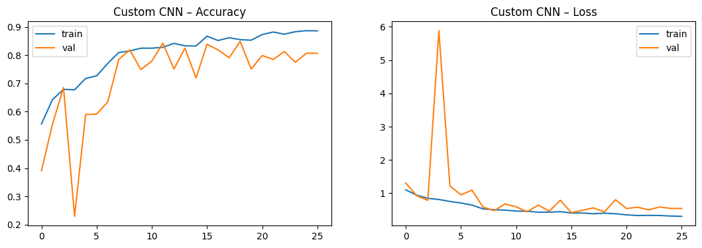
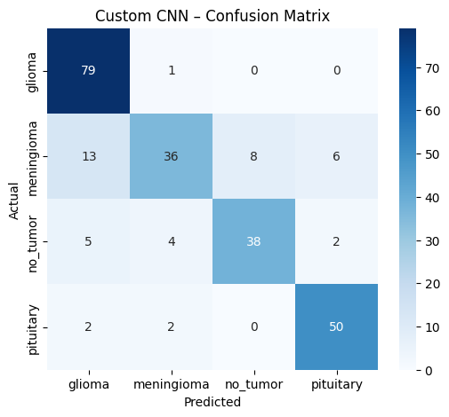
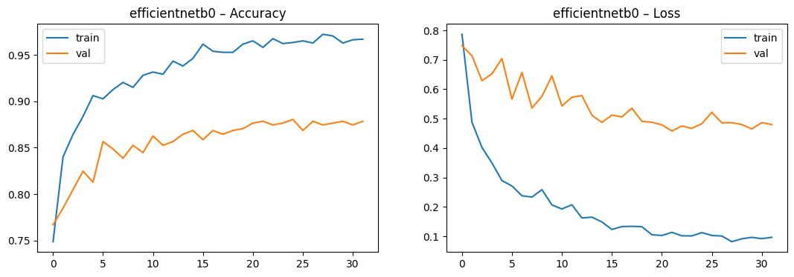
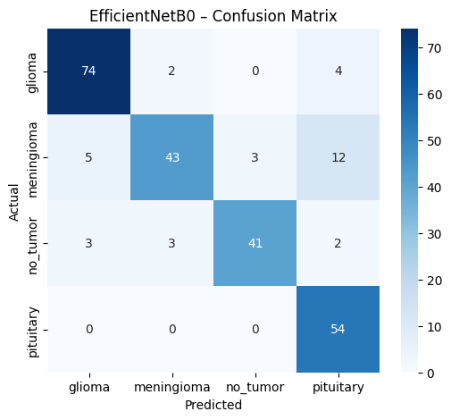

# 🧠 Brain Tumor MRI Image Classification

Deep-learning system that classifies brain MRI scans into **4 classes — glioma, meningioma, pituitary tumor, and no tumor** — comparing a custom CNN built from scratch against two fine-tuned ImageNet models, and serving the best one through a Streamlit web app.


> ⚠️ **Disclaimer:** This is an educational project. It is **not** a medical device and must not be used for clinical diagnosis.

---

## 📌 Highlights

| | |
|---|---|
| **Best model** | MobileNetV2 (ImageNet, fine-tuned) |
| **Test accuracy** | **89.0%** (macro F1 0.889) |
| **Leakage-free test accuracy** | **89.4%** on 179 test images whose source MRI never appears in train/valid |
| **Models compared** | Custom CNN · MobileNetV2 · EfficientNetB0 |
| **Inference speed** | ~39 ms / image (Kaggle T4 GPU) |
| **Model size** | 26.7 MB |

---

## 🩺 Problem Statement

Manual reading of brain MRI scans is slow and depends heavily on specialist availability. This project builds an image classifier that can act as an **AI assistant for radiologists** — giving a fast first read of tumor type, helping triage urgent scans, and supporting second-opinion systems in under-resourced regions.

**Business use cases**
1. **AI-assisted diagnosis** — faster turnaround for radiologists.
2. **Early detection & triage** — flag high-risk scans for immediate review.
3. **Research & clinical trials** — segment patient datasets by tumor type.
4. **Second-opinion / telemedicine** — remote diagnostic support.

---

## 📂 Dataset

**Labeled MRI Brain Tumor Dataset** (Roboflow Universe, CC BY 4.0) — 2,443 RGB JPEG images, 640×640.

| Class | Train | Valid | Test |
|---|---:|---:|---:|
| Glioma | 564 | 161 | 80 |
| Meningioma | 358 | 124 | 63 |
| No tumor | 335 | 99 | 49 |
| Pituitary | 438 | 118 | 54 |
| **Total** | **1,695** | **502** | **246** |

<p align="center">
  
</p>
<p align="center">
  
</p>

The classes are **imbalanced** (glioma has ~1.7× more training images than no_tumor), which is handled with **balanced class weights** during training.

---

## ⚙️ Pipeline

```
Raw MRI (640×640)
   │
   ├─► Resize to 224×224 · load with tf.data (batch 32, prefetch)
   │
   ├─► Augmentation (train only): flip · rotation · zoom · shift · brightness · contrast
   │
   ├─► Normalization inside each model (Rescaling layer)
   │        Custom CNN → [0, 1]   ·   MobileNetV2 → [-1, 1]   ·   EfficientNetB0 → built-in
   │
   ├─► Training with class weights + EarlyStopping + ModelCheckpoint + ReduceLROnPlateau
   │
   ├─► Evaluation: accuracy · precision · recall · F1 · confusion matrix
   │
   └─► Best model → best_model.keras → Streamlit app
```

**Design choices**
- **Preprocessing lives inside the model.** The saved model takes raw 0–255 pixels, so the app can never apply the wrong normalization.
- **Augmentation is applied in the `tf.data` pipeline, not inside the model**, so the exported model is clean for inference.
- **No vertical flips.** Upside-down brain scans are anatomically unrealistic.

<p align="center">
  
</p>

---

## 🏗️ Models

### 1. Custom CNN (from scratch)
4 convolutional blocks `[32 → 64 → 128 → 256 filters]`, each with **2× Conv2D + BatchNorm + ReLU → MaxPool → Dropout(0.2)**, followed by GlobalAveragePooling → Dense(256) → Dropout(0.5) → Softmax(4). ~1.24 M parameters.

> **Debugging note:** The first run had `val_accuracy` stuck at 0.3207 (it predicted glioma for every image) because BatchNorm's running statistics (momentum 0.99) lagged behind training. Lowering BatchNorm momentum to 0.9 and the learning rate to 5e-4 fixed it.

### 2 & 3. Transfer Learning — MobileNetV2 and EfficientNetB0
ImageNet backbone → GlobalAveragePooling → BatchNorm → Dense(256) → Dropout(0.4) → Softmax(4), trained in **two phases**:

| Phase | What trains | LR | Max epochs |
|---|---|---|---|
| **1. Feature extraction** | New head only (backbone frozen) | 1e-3 | 15 |
| **2. Fine-tuning** | Top 40 (MobileNetV2) / 60 (EfficientNetB0) backbone layers + head; BatchNorm layers kept frozen | 1e-5 | 25 |

**Callbacks:** `EarlyStopping(val_loss, patience=10, restore_best_weights)`, `ModelCheckpoint`, `ReduceLROnPlateau(factor=0.3, patience=4)`.

---

## 📊 Results

### Model comparison (test set, 246 images)

| Model | Accuracy | Precision | Recall | F1 (macro) | Params | Size | ms / image |
|---|---:|---:|---:|---:|---:|---:|---:|
| **MobileNetV2** 🏆 | **0.890** | **0.892** | **0.892** | **0.889** | 2.59 M | 26.7 MB | 38.7 |
| EfficientNetB0 | 0.862 | 0.870 | 0.861 | 0.857 | 4.38 M | 41.9 MB | 54.0 |
| Custom CNN | 0.825 | 0.831 | 0.815 | 0.814 | 1.24 M | 15.0 MB | 8.8 |

<p align="center">
  
</p>

### Per-class performance — MobileNetV2

| Class | Precision | Recall | F1 |
|---|---:|---:|---:|
| Glioma | 0.947 | 0.900 | 0.923 |
| Meningioma | 0.823 | 0.810 | 0.816 |
| No tumor | 0.955 | 0.857 | 0.903 |
| Pituitary | 0.844 | **1.000** | 0.915 |

<p align="center">
  
  
</p>

<details>
<summary><b>Custom CNN & EfficientNetB0 — training curves and confusion matrices</b></summary>

**Custom CNN**
<p align="center">
  
  
</p>

**EfficientNetB0**
<p align="center">
  
  
</p>
</details>

### 🔍 Data-leakage audit

Roboflow exports keep the original filename prefix (e.g. `Tr-gl_0016_jpg.rf.<hash>.jpg`). Grouping images by that prefix showed that **the same source MRI appears in more than one split**:

| Overlap | Source images shared |
|---|---:|
| Train ↔ Test | 57 |
| Train ↔ Valid | 97 |
| Valid ↔ Test | 10 |

To get an honest score, every model was re-evaluated on the **179 test images whose source never appears in train or valid**:

| Model | Full test acc. | Clean test acc. | Clean F1 |
|---|---:|---:|---:|
| **MobileNetV2** | 0.890 | **0.894** | **0.889** |
| EfficientNetB0 | 0.862 | 0.844 | 0.830 |
| Custom CNN | 0.825 | 0.765 | 0.736 |

**Takeaway:** MobileNetV2 holds its accuracy on unseen patients, so its score is not inflated by leakage. The custom CNN drops ~6 points, which shows it relied more on near-duplicate images. This makes the case for transfer learning stronger.

### Key findings
- **Transfer learning clearly beats training from scratch** on a dataset of only ~1.7k training images (+6.5 points accuracy, +12.9 points on the clean test set).
- **MobileNetV2 is the best deployment choice.** It is the most accurate model, 37% smaller and ~28% faster than EfficientNetB0.
- **Meningioma is the hardest class for every model.** It is most often confused with pituitary and glioma, since these tumor types can look similar on MRI.
- **Fine-tuning added ~3–5 points** of validation accuracy over a frozen backbone.

---

## 🗂️ Repository Structure

```
brain-tumor-mri-classifier/
├── app.py                      # Streamlit web app
├── requirements.txt
├── best_model.keras            # Deployed model (MobileNetV2)
├── class_names.json            # Class order + model metadata
├── models/
│   ├── custom_cnn.h5
│   ├── mobilenetv2.h5
│   └── efficientnetb0.h5
├── notebook/
│   └── brain_tumor_mri_classification.ipynb   # Full training & evaluation (Kaggle)
└── results/
    ├── model_comparison.csv
    ├── model_comparison_clean_test.csv
    └── figures/                # EDA, training curves, confusion matrices
```

---

## 🚀 Run Locally

```bash
git clone https://github.com/Ankit-builds1/brain-tumor-mri-classifier.git
cd brain-tumor-mri-classifier
pip install -r requirements.txt
streamlit run app.py
```

Open `http://localhost:8501`, upload an MRI image (`.jpg` / `.png`), and the app shows the predicted tumor type with a confidence score for each class.

### Use the model in Python

```python
import json, numpy as np, tensorflow as tf
from PIL import Image

model = tf.keras.models.load_model("best_model.keras", compile=False)
classes = json.load(open("class_names.json"))["classes"]

img = Image.open("mri.jpg").convert("RGB").resize((224, 224))
probs = model.predict(np.array(img, dtype=np.float32)[None, ...])[0]   # raw 0–255 input
print(classes[probs.argmax()], f"{probs.max():.2%}")
```

### Reproduce training
1. Upload the dataset's `train/`, `valid/` and `test/` folders as a Kaggle dataset.
2. Open `notebook/brain_tumor_mri_classification.ipynb` on Kaggle with **GPU T4** and **Internet ON**.
3. Run all cells. The notebook finds the data folders automatically and saves every model to `/kaggle/working`.

---

## 🛠️ Tech Stack

**Deep learning:** TensorFlow 2.20 · Keras 3 · MobileNetV2 · EfficientNetB0
**Data & evaluation:** NumPy · Pandas · scikit-learn · Matplotlib · Seaborn
**Deployment:** Streamlit
**Compute:** Kaggle Notebooks (NVIDIA T4 GPU)

---

## ⚠️ Limitations & Future Work

- **Small dataset.** About 2.4k images from a single source, so performance on scanners from other hospitals is unknown.
- **Split leakage in the source dataset.** It is measured above. A patient-level re-split would give a fully clean benchmark.
- **No explainability yet.** Next step: **Grad-CAM heatmaps** in the app to show which region drove each prediction.
- **Possible improvements:** test-time augmentation, model ensembling, a larger image size for the meningioma/pituitary confusion, and TFLite quantization for mobile.

---

## 🙏 Acknowledgements

- Dataset: [Labeled MRI Brain Tumor Dataset](https://universe.roboflow.com/ali-rostami/labeled-mri-brain-tumor-dataset) by Ali Rostami on Roboflow Universe (CC BY 4.0).
- Pretrained weights: ImageNet via `keras.applications`.

## 👤 Author

**Ankit Dash**: B.Tech CSE (Data Analytics & Machine Learning), Centurion University of Technology and Management
GitHub: [@Ankit-builds1](https://github.com/Ankit-builds1)
